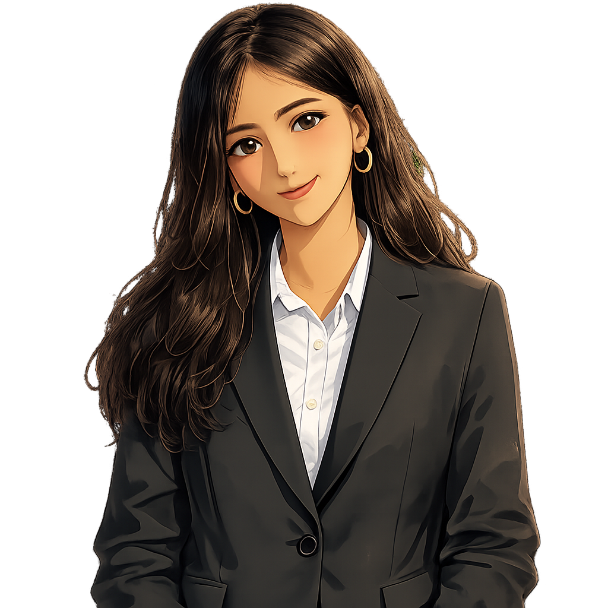

# Bhuvya Shukla — Portfolio

## Project Structure

```
bhuvya-portfolio/
│
├── index.html          ← Main HTML file (open this in a browser)
├── README.md           ← This file
│
├── css/
│   └── style.css       ← All styles (colours, layout, animations)
│
├── js/
│   └── main.js         ← Bookshelf builder + scroll reveal + mobile nav
│
└── images/
    └── photo.jpg       ← ★ PUT YOUR PHOTO HERE (see instructions below)
```

---

## ★ How to Add Your Photo

**Your photo file must be named exactly:**

```
photo.jpg
```

Place it inside the `images/` folder.

Then open `index.html` in a text editor and do the following in **two places**:

### 1. Hero section (large photo, top of page)
Find this block and **uncomment** the `` line, then **delete** the placeholder `<div>`:

```html
<!--  -->
```
→ Change to:
```html

```

### 2. About section (portrait photo)
Find this block and **uncomment** the `` line, then **delete** the placeholder `<div>`:

```html
<!--  -->
```
→ Change to:
```html

```

---

## Tips
- Best photo format: JPG or PNG, portrait orientation
- Recommended size: at least 600×800 px
- The CSS automatically applies a subtle grayscale + contrast filter for the editorial aesthetic
- Open `index.html` directly in Chrome/Firefox to preview

---

## To Edit Content
- **Text / sections** → edit `index.html`
- **Colours, fonts, spacing** → edit `css/style.css`
- **Bookshelf books, animations** → edit `js/main.js`
